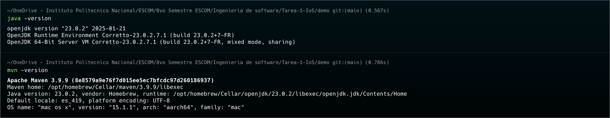
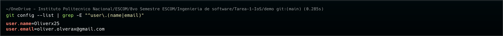
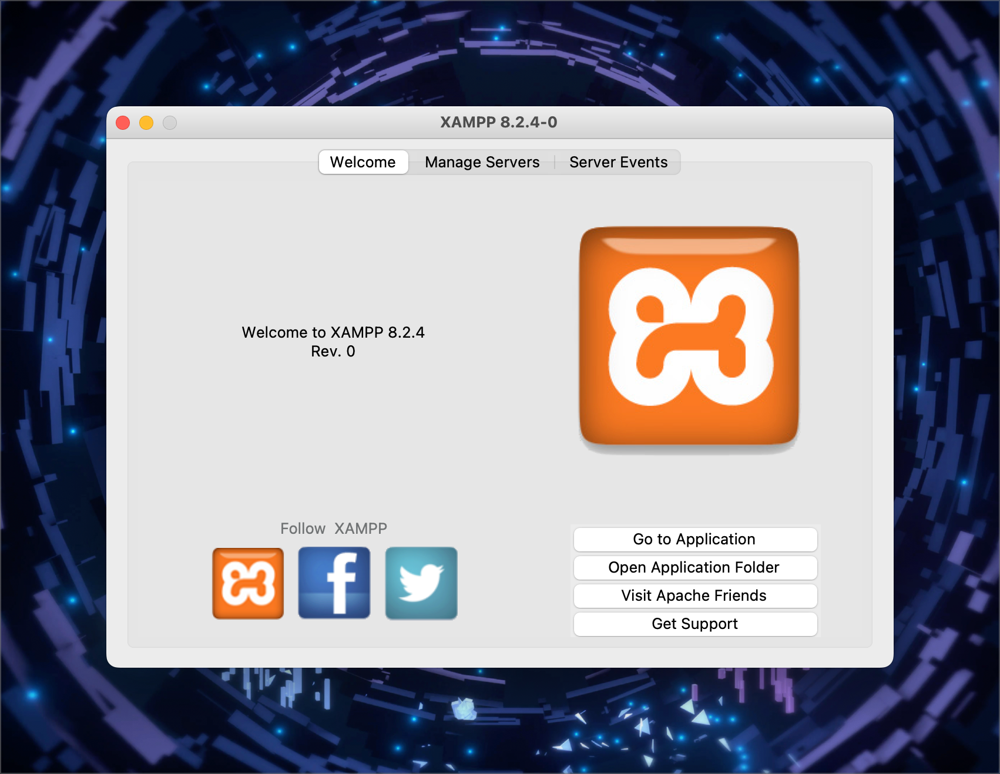
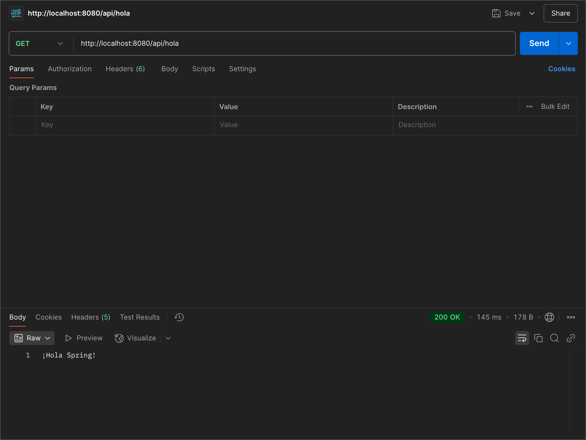

# Ejercicio 1: Instalación y configuración de herramientas

## Pasos previos a la implementación del proyecto
Se requiere instalar las siguientes herramientas (Sistema operativo Mac M1):

> [!IMPORTANT]
> Asegurate de tener instalado Homebrew en el dispositivo MacOS.
```sh
/bin/bash -c "$(curl -fsSL https://raw.githubusercontent.com/Homebrew/install/HEAD/install.sh)"
```

- Java Development Kit (JDK):
	Para instalar el JDK, ejecuta el siguiente comando en la terminal:
``` sh
brew install openjdk
```
Después de la instalación, agrega el JDK a tu PATH:
``` sh
echo 'export PATH="/opt/homebrew/opt/openjdk/bin:$PATH"' >> ~/.zshrc
source ~/.zshrc
```
- Maven
Para instalar Maven, ejecuta el siguiente comando en la terminal:
```sh
brew install maven
```
- Spring Boot
Para instalar Spring Boot, ejecuta el siguiente comando en la terminal:

```sh
brew install spring-boot
```
O solo busca lo siguiente en extensines de VScode `Spring Boot Extension Pack`
- Git
Para instalar Git, ejecuta el siguiente comando en la terminal:
```sh
brew install git
```
- XAMPP

Para instalar XAMPP, sigue estos pasos:

1. Descarga el instalador de XAMPP desde el sitio oficial.
2. Abre el archivo descargado y sigue las instrucciones del instalador.
3. Una vez instalado, puedes iniciar XAMPP desde la carpeta de aplicaciones.

**Verificación de instalación**

Para verificar que las herramientas se han instalado correctamente, puedes ejecutar los siguientes comandos en la terminal:

- JDK: `java -version`
- Maven: `mvn -version`
- Spring Boot: `spring --version`
- Git: `git --version`
- XAMPP: Abre el panel de control de XAMPP y verifica que los servicios se inicien correctamente.

## Comprobación de ejecuciones





